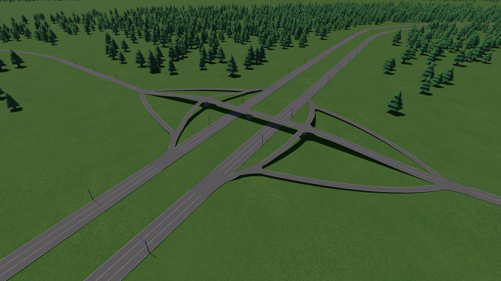
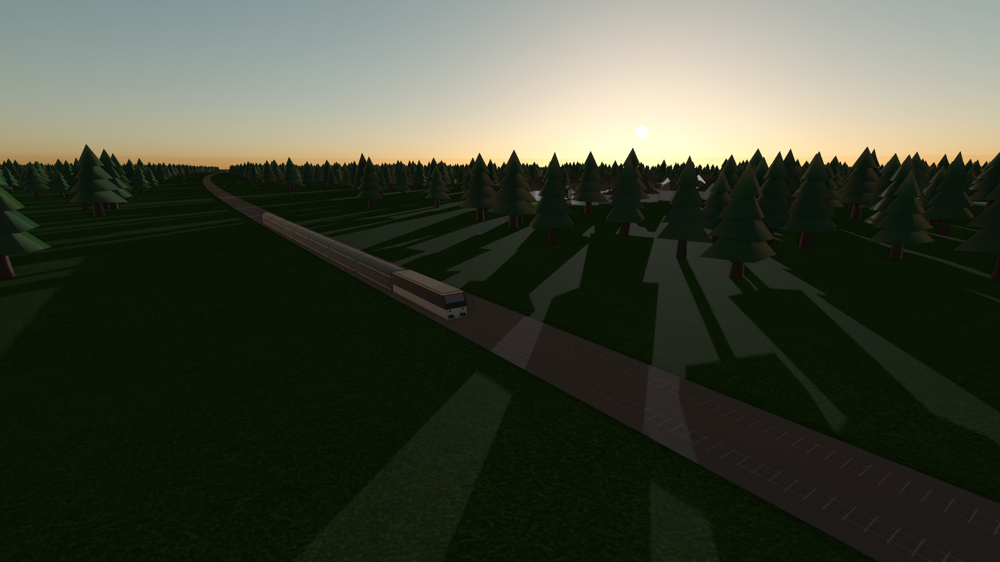
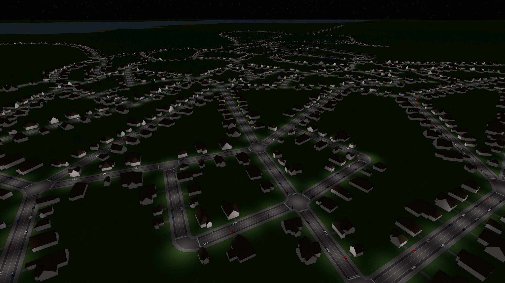

[](#)
[](https://discord.gg/CAaZhUJ)

# Egregoria

Egregoria — инди-градостроительный симулятор, вдохновлённый Cities: Skylines.
В игре у каждого жителя есть собственная модель поведения, поэтому каждое действие игрока влияет на экономику, логистику и жизнь города.

Проект open source и находится в активной разработке.
Обратную связь можно оставить в [issues](https://github.com/Uriopass/Egregoria/issues) или в [Discord](https://discord.gg/CAaZhUJ).

## Что нового в релизе 0.7.0

- Улучшен интерфейс и исправлено сохранение/загрузка настроек.
- Добавлено и доработано терраформирование.
- Исправлены баги строительства дорог на высоте.
- Исправлено поведение языковых настроек (English/Russian).
- Добавлен режим пониженного рендер-разрешения для macOS (Retina) через настройки.

## Как играть

Небольшой гайд по старту доступен в [wiki](https://github.com/Uriopass/Egregoria/wiki/Introduction-Guide).

## Сборка проекта

### Git LFS

В проекте используются Git LFS-ассеты.

```bash
git clone https://github.com/Uriopass/Egregoria
cd Egregoria
git lfs pull
```

### Быстрый запуск (dev)

```bash
cargo run --release
```

Без `--release` производительность будет значительно хуже.

### Linux (Ubuntu/Debian, X11)

```bash
sudo apt-get install libasound2-dev libudev-dev pkg-config libx11-dev
cargo run --release
```

## Релизные сборки

### macOS (Apple Silicon)

```bash
cargo build -p native_app --release --target aarch64-apple-darwin
```

### Windows (GNU target)

```bash
cargo build -p native_app --release --target x86_64-pc-windows-gnu
```

### Linux (GNU target)

```bash
cargo build -p native_app --release --target x86_64-unknown-linux-gnu
```

## Почему Egregoria

Эгрегор — это автономная сущность, возникающая из мыслей и взаимодействий множества людей.
Название подчёркивает идею эмерджентности: множество агентов формируют сложное коллективное поведение.

## Credits

- [`@dabreegster`](https://github.com/dabreegster): за вдохновение для модели карты
- PBR-шейдеры адаптированы из [LearnOpenGL](https://learnopengl.com/PBR/Theory)
